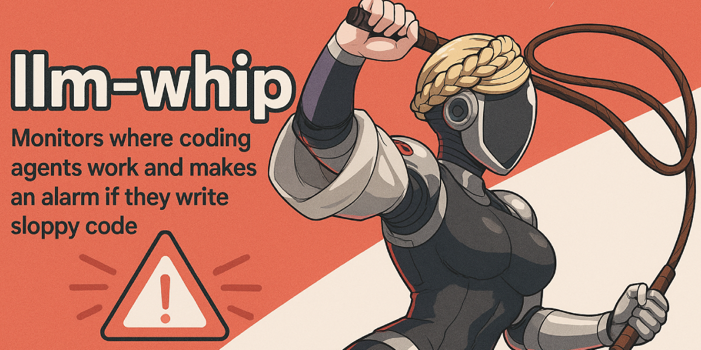

# LLM Whip

[](https://www.npmjs.com/package/llm-whip)
[](https://www.npmjs.com/package/llm-whip)
[](https://github.com/bewinxed/llm-whip/actions)
[](https://www.typescriptlang.org/)
[](https://opensource.org/licenses/MIT)



A TypeScript CLI tool that monitors code for lazy patterns and anti-cheat detection when working with LLMs.

## Overview

LLM Whip detects common shortcuts and anti-patterns in code:

-   TODO comments and placeholders
-   Stub implementations
-   "The important thing is..." statements
-   Not implemented errors
-   Other lazy coding patterns

## Features

-   **Directory Auditing**: Scan codebases for existing patterns
-   **Real-time Monitoring**: Watch files as they change
-   **TypeScript Configuration**: Type-safe configuration files
-   **Multiple Output Formats**: Table, JSON, CSV export
-   **Baseline Tracking**: Alert only on new patterns
-   **Configurable Patterns**: Define custom detection rules

## Installation

```bash
bun add -g llm-whip
# or
npm install -g llm-whip
```

## Usage

```bash
# Show help
llm-whip --help

# Monitor current directory
llm-whip

# Monitor specific directories
llm-whip ./src ./lib

# Monitor with keyboard interrupts (sends text to active window)
llm-whip ./src --interrupt

# Create configuration file
llm-whip init

# Audit current directory
llm-whip audit
```

## Commands

| Command                    | Description                              |
| -------------------------- | ---------------------------------------- |
| `llm-whip`                 | Launch Claude with background monitoring |
| `llm-whip init [dir]`      | Create TypeScript configuration file     |
| `llm-whip audit [dirs...]` | Scan directories for patterns            |
| `llm-whip watch <dirs...>` | Monitor directories in real-time         |

## Options

| Option              | Description                                              |
| ------------------- | -------------------------------------------------------- |
| `--config=<path>`   | Custom configuration file                                |
| `--format=<type>`   | Audit output format (table/json/csv)                     |
| `--grep=<patterns>` | Filter files by content patterns                         |
| `--interrupt`       | Enable keyboard interrupts (sends text to active window) |

## Configuration

Create `llm-whip.config.ts`:

```typescript
import type { Config } from 'llm-whip/types';

export const config: Config = {
	patterns: [
		{
			name: 'todo',
			pattern: 'TODO',
			severity: 'high',
			reactions: ['sound', 'alert', 'interrupt'],
			message: 'TODO comment detected',
			interruptMessage:
				'TODO comments should be completed before submitting code. Please implement the actual functionality instead of leaving placeholder comments.',
		},
		{
			name: 'important-thing',
			pattern: 'The important thing is',
			severity: 'medium',
			reactions: ['alert'],
			interruptMessage:
				"Detected 'The important thing is...' - this often indicates avoiding detailed implementation. Please provide specific, actionable details.",
		},
	],
	reactions: {
		sound: { command: 'afplay /System/Library/Sounds/Basso.aiff' },
		interrupt: { delay: 500 },
		alert: { format: 'color' },
	},
	debounce: 2000,
	fileTracking: true,
};
```

## Default Patterns

Patterns use **JavaScript regex syntax** and are case-insensitive by default:

| Pattern           | Regex                                  | Example Match                        |
| ----------------- | -------------------------------------- | ------------------------------------ |
| `todo`            | `TODO`                                 | `// TODO: implement this`            |
| `placeholder`     | `placeholder\|stub`                    | `// placeholder implementation`      |
| `not-implemented` | `not implemented\|NotImplementedError` | `throw new Error("not implemented")` |
| `important-thing` | `The important thing is`               | `The important thing is to...`       |

**Custom Pattern Examples:**

```typescript
{
  name: "fixme",
  pattern: "FIXME\|BUG\|HACK",  // Matches FIXME, BUG, or HACK
  severity: "high"
},
{
  name: "console-log",
  pattern: "console\\.(log\|debug)",  // Matches console.log or console.debug
  severity: "low"
}
```

## Keyboard Interrupts

The `--interrupt` flag enables keyboard interrupts that send detailed messages to the active window when patterns are detected:

```bash
# Enable keyboard interrupts
llm-whip ./src --interrupt
```

When a pattern is detected, LLM Whip will:

1. Send Escape and Ctrl+C to the active window
2. Type a detailed message including:
    - Pattern type and custom message
    - File path and line number
    - The detected code line
    - Timestamp

Each pattern can have a custom `interruptMessage` that gets sent to Claude:

```typescript
{
  name: "todo",
  pattern: "TODO",
  reactions: ["interrupt"],
  interruptMessage: "TODO comments should be completed before submitting code. Please implement the actual functionality instead of leaving placeholder comments."
}
```

## Advanced Usage

### Baseline Tracking

Only alert on new patterns:

```bash
llm-whip audit ./src > /dev/null
llm-whip watch ./src
```

### Export Formats

```bash
# JSON export
llm-whip audit ./src --format=json > issues.json

# CSV export
llm-whip audit ./src --format=csv > issues.csv
```

### Configuration Priority

1. Local `llm-whip.config.ts` (current directory)
2. Custom path via `--config=path`
3. Built-in defaults

## Development

```bash
bun install
bun test
bun run build
```

## License

MIT
